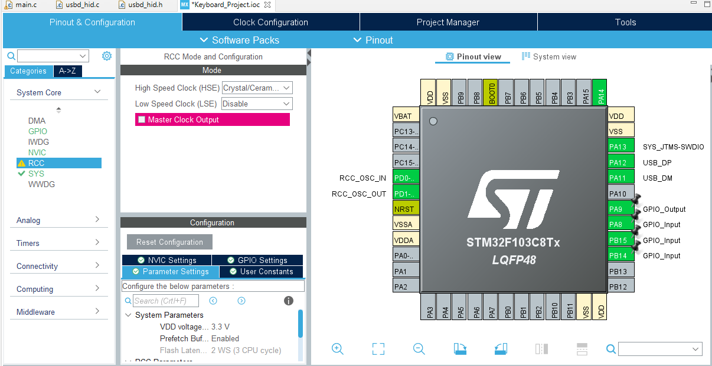

# Keyboard_Project__STM32F103C8

 
===============   Setup Pins   ===============  

===============   Observations   ===============  
In case you change the .ioc MX, the usbd_hid.c and usbd_hid.h  in this local : \Keyboard_Project__STM32F103C8\Middlewares\ST\STM32_USB_Device_Library\Class\HID\Src

and this \Keyboard_Project__STM32F103C8\Middlewares\ST\STM32_USB_Device_Library\Class\HID\Inc respectively, are going to regenrate the standard code, and you are going to miss every configuration you have made in this two places.

===============   Important places to code in .main   ===============
 

/* USER CODE BEGIN PV */  
//Here you declare global variables  
/* USER CODE END PV */  
 
 
/* USER CODE BEGIN PFP */  
Functions Declaration (helps to remove warnings of program)  
e.g. :  
void function();  
/* USER CODE END PFP */  
 
 
/* USER CODE BEGIN WHILE */  
while (1)  
{  
//Here comes the code that´s gonna work in loop  

 /* USER CODE BEGIN 3 */  
 
 //If you are using STM32 as a HID(Human Interface Device) you should put your code that is going to repeat inside this tag  
 
  /* USER CODE END 3 */  

 
 /* USER CODE END WHILE */  
  
 
/* USER CODE BEGIN 4 */  
Here you put the functions that you are going to use or call  
e.g. :  
void function() {  
//CODE  
}  
 
/* USER CODE END 4 */  

